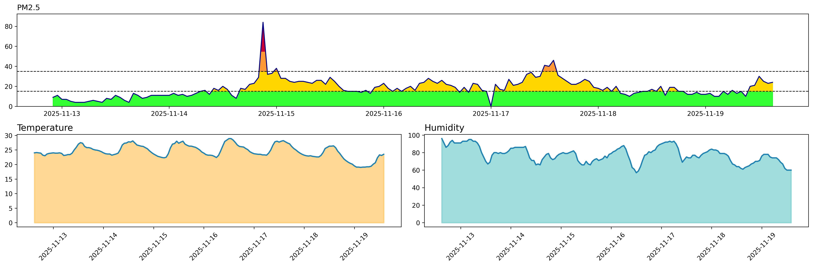
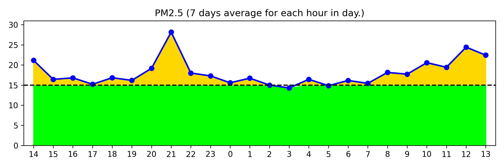

# airdb-model_airBox

## Result Previews

### total



### pm25_average



## Development

### Build and Run

Build the Docker image:

```bash
docker build -f Dockerfile.dev -t airbox-dev . --no-cache
```

Set your Google API key:

```bash
export GOOGLE_API_KEY="your_api_key_here"
export MOE_API_KEY="your_api_key_here"
```

Run the container:

> **Warning**: This command mounts your local ./app directory into the container.
**Any changes made inside the container—including edits, moves, or deletions—will affect your local files as well.**
There is no safety buffer: deleting a file in the container deletes it on your machine.

```bash
docker run -p 8001:8000 \
  --name airbox-container \
  -e GOOGLE_API_KEY=$GOOGLE_API_KEY \
  -e MOE_API_KEY=$MOE_API_KEY \
  -v $(pwd)/app:/code/app \
  --rm airbox-dev
```

The backend will now be available at: http://127.0.0.1:8001

To enter the running container for debugging:

```bash
docker exec -it airbox-container /bin/bash
```

### API Usage

Example: send a request to the /run endpoint:

```bash
curl -X POST "http://127.0.0.1:8001/run" \
  -H "Content-Type: application/json" \
  -d '{"address": "target_address"}'
```